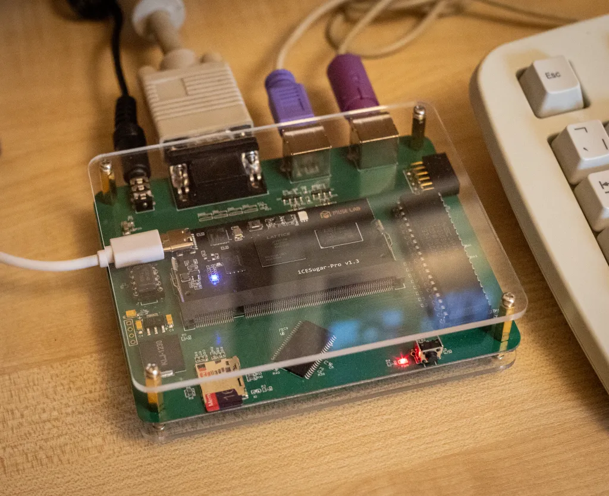

# ICEXT

IceXt is a modern IBM PC XT compatible computer using a mixture of authentic hardware and an FPGA.

Features:
- NEC V20 CPU Running at 10Mhz
- 1MB on board system SRAM
- ICESugar Pro FPGA
- CGA graphics
- Partial EGA graphics
- PS/2 Keyboard and mouse support
- Adlib audio with YM3014 DAC
- SDCard hard diskc emulation
- Onboard Peizo internal speaker

Structure:
- gateware: All Verilog sources for the FPGA
- hardware: PCB gerber files and schematics
- bin: Precompiled gateware
- roms: boot roms and video character glyphs
- media: premade boot media for the system
- datasheets: various datasheets for the devices used or modeled

----

----
